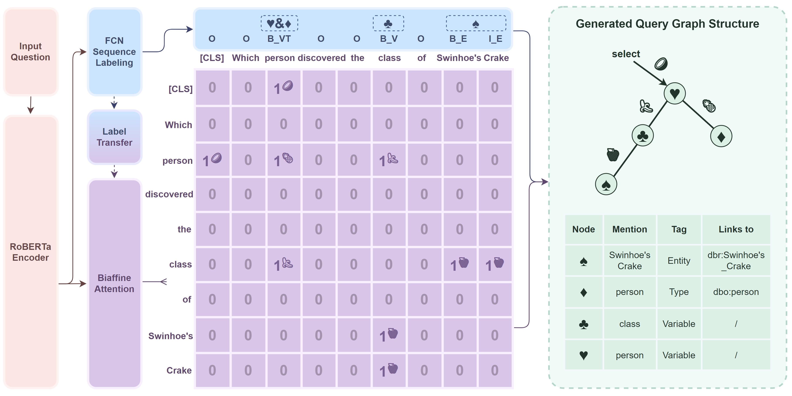

# Which person discovered the class of Swinhoe's Crake?

> Source code for "Crake: Causal-Enhanced Table-Filler for Question Answering over Large Scale Knowledge Base" to appear at NAACL 2022 Findings

> Due to the nature of KBQA pipelines (that require specific KB servers, KB linking APIs, etc.), despite our efforts to release all our codes and provide the instructions, this process is rather complicated to implement from scratch and may contain erroneous edge cases (we apologize in advance for the potential issues:), please feel free to reach out to us for any questions, thanks!



## To train a model for GSG

* Run the training script below
```
cd src_main/QG_TF_NE_multitask
python main.py
```
* See `../data/checkpoint/QG_TF_NE_cmtl_fcn_no_pretrain/qg_tf_ne_dev.pth` for the saved checkpoint
* A well-trained GSG model can be found **[here](https://disk.pku.edu.cn:443/link/080CE9D887E3E6F05FAFCFFD36E85C6C)**

## To train a model for RE

* Run the preprocessing & training script below
```
cd src_main/RE
# Preprocessing
python preprocess_data.py
# Training
python main.py
```
* See `../data/checkpoint/RE_Roberta_small_samp/roberta_dev_latest.pth` for the saved checkpoint
* A well-trained RE model can be found **[here](https://disk.pku.edu.cn:443/link/0896756C2C74978680B08912957552BE)**

## To run end-to-end evaluations
* 

### Build a KB server

* Download the 2016-04 version of DBpedia from https://downloads.dbpedia.org/wiki-archive/dbpedia-version-2016-04.html

* The full list include:
```
dbpedia_2016-04.nt
infobox_properties_en.ttl
infobox_properties_mapped_en.ttl
instance_types_dbtax_ext_en.ttl
instance_types_en.ttl
instance_types_lhd_ext_en.ttl
instance_types_sdtyped_dbo_en.ttl
instance_types_transitive_en.ttl
labels_en.ttl
mappingbased_literals_en.ttl
mappingbased_objects_en.ttl
mappingbased_objects_uncleaned_en.ttl
persondata_en.ttl
skos_categories_en.ttl
specific_mappingbased_properties_en.ttl
topical_concepts_en.ttl
uri_same_as_iri_en.ttl
```

* Build a knowledge base server for DBpedia, see https://github.com/pkumod/gStore

* Run the server at the background

### Build a DBpedia Lookup API

* Use docker-compose to start the DBpedia linker, see https://github.com/dbpedia/dbpedia-lookup
* We use the `dbpedia-lookup-search-prebuilt` index

### Run the GSG stage

```
cd src_main/pipeline
```
* Modify the code in **tf_ne_qg_link.py** as below
* To customize the clients of Lookup-API and KB server according to the ip/port the server is running on
```
# 
{
    ...
    'kb_host_ip': '111.111.222.222',
    'kb_host_port': 1234,
    'lookup_url': 'http://111.111.222.222:5678/lookup-application/api/search',
    ...
}
```

* Run the GSG stage using the model trained before

```
python tf_ne_qg_link.py
```

* The intermediate results of GSG generated can be found in `../result/NEQG_inference_results/test_neqg_link_1219_cmtl.json`. A sample file is also provided in the **[data](https://disk.pku.edu.cn:443/link/DBDCD2A63ABDF4173FC873119A754F74)** supplementaries.


### Run the RE stage
* Firstly, copy the RE well-trained RE model to the the RE model server directory
```
cp src_main/data/checkpoint/RE_Roberta_small_samp/roberta_dev_latest.pth re_model_server/data/checkpoint_en/RE_Roberta/
```
* Start the RE server at background on localhost
```
cd re_model_server
python server.py
```

* Modify the code in **pipeline.py** as below
* To customize the clients of RE model server and KB server according to the ip/port the server is running on
```
# 
{
    ...
    'kb_host_ip': '111.222.111.222',
    'kb_host_port': 9275,
    're_host_ip': 'localhost',
    're_host_port': 9305,
    ...
}
```

* Run the RE stage using the model trained before, which also gives the end-to-end evaluation results

```
python pipeline.py
```

* The results can be found in `../result/RE_inference_results/test_re_1219_cmtl.json`. A sample file is also provided in the **[data](https://disk.pku.edu.cn:443/link/C9D1012A955B40BC466F498BBFC16A0E)** supplementaries.
